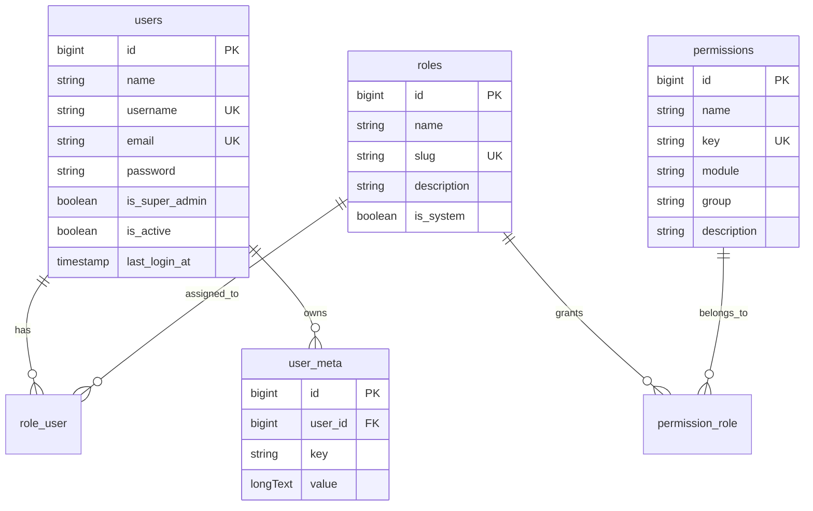

# ACL Schema

P1-01 defines the first admin access-control schema for the CMS.

## Goals

- Keep the default Laravel `users` table as the account source.
- Add CMS admin state directly to `users`.
- Store permissions as flexible string keys such as `users.index`, `users.edit`, and `roles.delete`.
- Let later modules register their own permissions without changing this schema.

## Tables

### users

Laravel owns the base table. The core base module adds:

- `username`: optional unique admin-friendly login/display handle.
- `is_super_admin`: bypasses normal ACL checks.
- `is_active`: disables admin access without deleting the account.
- `last_login_at`: records the last successful admin login.

### roles

Stores reusable permission sets.

- `name`: human-readable role label.
- `slug`: unique stable identifier.
- `description`: optional note for admins.
- `is_system`: protects built-in roles such as Super Admin.

### permissions

Stores known permission keys for admin UI assignment and QA.

- `name`: human-readable permission label.
- `key`: unique string permission key.
- `module`: owning module, for example `core/base`.
- `group`: optional UI grouping, for example `users`.
- `description`: optional note for admins.

Permission checks should use `key`, not numeric IDs.

### role_user

Many-to-many pivot between users and roles.

### permission_role

Many-to-many pivot between permissions and roles.

### user_meta

Flexible per-user metadata for CMS preferences and profile details that do not deserve dedicated columns yet.

## ERD



## Follow-Up Tasks

- P1-02 creates Eloquent models and relationships for this schema.
- P1-03 seeds the first Super Admin role and admin user.
- P1-07 adds the permission registry so modules can declare permission keys.

## Model Layer

P1-02 maps this schema to Eloquent:

- `App\Models\User`: owns `roles()` and `meta()` relationships.
- `Sitewyn\Core\Base\Models\Role`: owns `users()` and `permissions()` relationships.
- `Sitewyn\Core\Base\Models\Permission`: owns `roles()` relationship.
- `Sitewyn\Core\Base\Models\UserMeta`: belongs to one user.

Core base also provides factories for `Role`, `Permission`, and `UserMeta`.

Run the sample ACL seeder when development data is useful:

```bash
php artisan db:seed --class=Sitewyn\\Core\\Base\\Database\\Seeders\\AclSampleSeeder
```

## Super Admin Seed

P1-03 adds `Sitewyn\Core\Base\Database\Seeders\SuperAdminSeeder` and wires it into the root `DatabaseSeeder`.

Configure the first admin account through `.env`:

```dotenv
SITEWYN_ADMIN_NAME="Super Admin"
SITEWYN_ADMIN_USERNAME=admin
SITEWYN_ADMIN_EMAIL=admin@example.com
SITEWYN_ADMIN_PASSWORD=password
```

Then run:

```bash
php artisan db:seed
```

The seeder is idempotent: it keeps one `super-admin` system role, one admin account per configured email, and attaches that role to the account.

## Admin Login

P1-04 adds the first admin login/logout flow. See `docs/admin-auth.md` for routes, guard behavior, and verification commands.

P1-05 adds permission helpers to `App\Models\User`:

- `hasPermission('users.edit')`
- `hasAnyPermission(['users.edit', 'roles.index'])`
- `hasAllPermissions(['users.index', 'roles.index'])`
- `permissionKeys()`

`is_super_admin` bypasses all permission checks. The core base provider also
bridges these helpers into Laravel Gate, so Blade `@can('users.index')` and
controller `Gate::allows('users.index')` use the same role permission data.

## Permission Middleware

P1-06 registers the `permission` route middleware alias from the core base
provider:

```php
Route::middleware(['auth:admin', 'permission:users.index'])->group(function () {
    // Admin routes requiring users.index.
});
```

The middleware checks the current admin guard user first, then falls back to the
default request user. Requests without an authenticated user, without permission
arguments, or without at least one matching permission are rejected with 403.
Super admin users still pass through the same `hasAnyPermission()` helper and
therefore keep the ACL bypass defined in P1-05.

## Permission Registry

P1-07 adds `Sitewyn\Core\Base\Support\PermissionRegistry` so each module can
declare its own admin permission keys from its service provider:

```php
use Sitewyn\Core\Base\Support\PermissionRegistry;

$this->app->make(PermissionRegistry::class)->register([
    [
        'key' => 'posts.index',
        'name' => 'View posts',
        'group' => 'posts',
        'description' => 'View blog post list.',
    ],
], 'plugins/blog');
```

Core base registers the first MVP permission set:

- `users.index`, `users.create`, `users.edit`, `users.delete`
- `roles.index`, `roles.create`, `roles.edit`, `roles.delete`
- `permissions.index`
- `settings.edit`

Feature packages register their own permission sets. The Media package registers:

- `media.index`, `media.upload`, `media.edit`, `media.delete`

Sync registered permissions into the database with:

```bash
php artisan permission:sync
```

The command is idempotent and updates existing rows by `key`, which keeps the
database aligned with module declarations without hardcoding all permissions in
one central seeder.

## Role Administration

P1-08 adds the first admin CRUD screens for roles. The routes now live under
`/admin/system/roles` (Platform Administration, mirroring the `system/users`
split); route names are `admin.system.roles.*`.

- `GET /admin/system/roles` lists roles with permission and user counts.
- `GET /admin/system/roles/create` and `POST /admin/system/roles` create
  custom roles.
- `GET /admin/system/roles/{role}/edit` and `PUT /admin/system/roles/{role}`
  update role details and assigned permissions.
- `DELETE /admin/system/roles/{role}` deletes custom roles only when no users
  are assigned.

All role routes use the admin guard and the `permission` middleware:
`roles.index`, `roles.create`, `roles.edit`, and `roles.delete`. Permission
keys are unchanged by the move. The controller
syncs registered permissions before rendering or saving so permission checkboxes
stay aligned with module declarations.

## User Administration

P1-09 adds admin CRUD screens for users:

- `GET /admin/users` lists admin users with role badges, active/locked state,
  super admin state, and last login time.
- `GET /admin/users/create` and `POST /admin/users` create users with one or
  more roles.
- `GET /admin/users/{user}/edit` and `PUT /admin/users/{user}` update profile
  details, roles, account status, super admin flag, and password.
- `DELETE /admin/users/{user}` deletes another admin account and detaches its
  role assignments.

User routes use `users.index`, `users.create`, `users.edit`, and `users.delete`.
Email and username are unique, update forms keep the current password when the
password fields are blank, and an admin cannot lock or delete their own account.

## Permission Administration

P1-10 adds a read-only admin permission index at `GET /admin/permissions`.
The page is protected by `permissions.index`, syncs registered permissions into
the database before rendering, and groups rows by module so QA can inspect which
module owns each key.

The page intentionally does not allow create, edit, or delete actions. Permission
definitions should continue to live in module service providers and be synced
through the registry.

## Privilege Escalation Guards

The users CRUD adds three guards so an admin holding only `users.edit` or
`users.create` cannot escalate privileges for themselves or others. All checks
live in `Sitewyn\Core\Base\Http\Controllers\Admin\UserController`.

1. **No self-modification of privileges.** When an admin edits their own account
   (`auth('admin')->id() === $user->id`), the `roles` and `is_super_admin` input
   keys are stripped silently before persisting. Role assignments are not
   re-synced and the super admin flag keeps its current value. Other fields
   (name, username, email, password) remain editable, and `is_active` is still
   forced to `true` for self-edits. This applies to every requester, including
   super admins.

2. **The super admin flag requires super admin.** When storing or updating any
   other user with a truthy `is_super_admin` input, a requester who is not a
   super admin receives a validation error:
   `Only super admins can grant the super admin flag.` Super admins keep full
   authority. The form only renders the Super Admin toggle for super admins, so
   regular admins never see the control.

3. **Role subset rule.** A non-super-admin requester may only assign roles whose
   permission keys are a subset of the requester's own permission keys
   (`permissionKeys()` from the `HasPermissions` trait). Assigning a role that
   grants any permission the requester does not have fails with:
   `You cannot assign a role with permissions you do not have.` A role with no
   permissions is always assignable. Super admins bypass this check. The user
   forms only list assignable roles: `UserController::assignableRoles()` filters
   the role collection by the same subset rule before rendering.

Escalation coverage lives in `tests/Feature/AdminUserEscalationTest.php`:
self-edit stripping, super admin flag rules on store/update, role subset
violations and allowed assignments, route permission gates, and form rendering
for both requester types.
