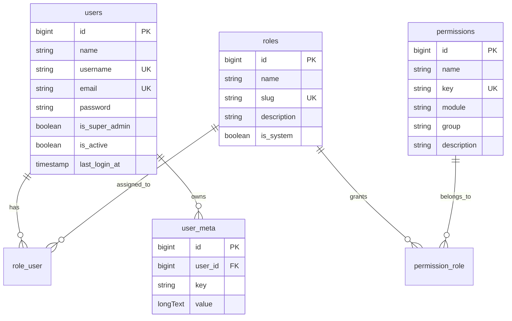

# ACL Schema

P1-01 defines the first admin access-control schema for the CMS.

## Goals

- Keep the default Laravel `users` table as the account source.
- Add CMS admin state directly to `users`.
- Store permissions as flexible string keys such as `users.index`, `users.edit`, and `roles.delete`.
- Let later modules register their own permissions without changing this schema.

## Tables

### users

Laravel owns the base table. The core base module adds:

- `username`: optional unique admin-friendly login/display handle.
- `is_super_admin`: bypasses normal ACL checks.
- `is_active`: disables admin access without deleting the account.
- `last_login_at`: records the last successful admin login.

### roles

Stores reusable permission sets.

- `name`: human-readable role label.
- `slug`: unique stable identifier.
- `description`: optional note for admins.
- `is_system`: protects built-in roles such as Super Admin.

### permissions

Stores known permission keys for admin UI assignment and QA.

- `name`: human-readable permission label.
- `key`: unique string permission key.
- `module`: owning module, for example `core/base`.
- `group`: optional UI grouping, for example `users`.
- `description`: optional note for admins.

Permission checks should use `key`, not numeric IDs.

### role_user

Many-to-many pivot between users and roles.

### permission_role

Many-to-many pivot between permissions and roles.

### user_meta

Flexible per-user metadata for CMS preferences and profile details that do not deserve dedicated columns yet.

## ERD



## Follow-Up Tasks

- P1-02 creates Eloquent models and relationships for this schema.
- P1-03 seeds the first Super Admin role and admin user.
- P1-07 adds the permission registry so modules can declare permission keys.

## Model Layer

P1-02 maps this schema to Eloquent:

- `App\Models\User`: owns `roles()` and `meta()` relationships.
- `Sitewyn\Core\Base\Models\Role`: owns `users()` and `permissions()` relationships.
- `Sitewyn\Core\Base\Models\Permission`: owns `roles()` relationship.
- `Sitewyn\Core\Base\Models\UserMeta`: belongs to one user.

Core base also provides factories for `Role`, `Permission`, and `UserMeta`.

Run the sample ACL seeder when development data is useful:

```bash
php artisan db:seed --class=Sitewyn\\Core\\Base\\Database\\Seeders\\AclSampleSeeder
```

## Super Admin Seed

P1-03 adds `Sitewyn\Core\Base\Database\Seeders\SuperAdminSeeder` and wires it into the root `DatabaseSeeder`.

Configure the first admin account through `.env`:

```dotenv
SITEWYN_ADMIN_NAME="Super Admin"
SITEWYN_ADMIN_USERNAME=admin
SITEWYN_ADMIN_EMAIL=admin@example.com
SITEWYN_ADMIN_PASSWORD=password
```

Then run:

```bash
php artisan db:seed
```

The seeder is idempotent: it keeps one `super-admin` system role, one admin account per configured email, and attaches that role to the account.

## Admin Login

P1-04 adds the first admin login/logout flow. See `docs/admin-auth.md` for routes, guard behavior, and verification commands.
